<div align="center">


# ScreenMemo

智能截屏备忘录 & 信息管理工具

「屏幕无痕，记忆有痕」

[](https://dart.dev) [](https://www.android.com) [](LICENSE)

一款基于 Flutter 开发的智能截屏管理应用，帮助你高效捕获、组织和回顾重要信息

</div>

<p align="center">
  <b>语言</b>:
  简体中文 |
  <a href="README.en.md">English</a> |
  <a href="README.ja.md">日本語</a> |
  <a href="README.ko.md">한국어</a>
</p>

---

## 项目简介与应用场景

ScreenMemo 是一款在本地运行的智能截屏备忘与检索工具：自动记录你在 Android 设备上的屏幕画面，通过 OCR 与 AI 总结让信息可检索、可回顾、可沉淀，帮助你在需要时迅速找回线索、还原上下文。

可以做什么：
- 找回曾在不同 App 里出现过的文字内容（如文章片段、聊天记录、字幕台词等），即使原内容已被撤回或下架，也能在本地历史中检索到。
- 追溯“我看过但想不起来在哪看到”的线索，支持时间范围与应用筛选，快速定位当时屏幕画面。
- 对同一时间段的多张截图进行 AI 总结，形成“每日总结”，用于回顾一天的重点活动、关键操作与内容要点。
- 导出/备份本地资料库，迁移或归档你的“第二记忆”。

典型使用场景：
- 回忆被撤回/删除的消息或页面内容；找回误点关闭的窗口信息。
- 通过关键词检索多日来回出现的台词、术语或关键字段，串联记忆碎片，支持多次出现的统计与回看。
- 复盘重要阶段（如做项目、写毕业设计、准备评审/绩效），用“每日总结”快速回顾当日要点，降低整理成本。
- 用于“记忆寻宝”：翻看以往被忽略的细节或灵感片段，启发创作与决策。

---
## 从今天开始构建你的个人数字记忆
为什么现在开始记录？
- 其他人已经在训练他们的个人 AI
- 别被落下，每一天不记录，都是你未来 AI 助手失去的一份知识

AI 领先差距
- 今天开始收集个人数据的人，在 AI 更强大时将拥有多年的优势

分散的数字自我
- 重要的个人上下文分散在各类应用与设备中——没有 ScreenMemo 很难统一利用


---

## 运行原理

1. 屏幕采集：在用户授权后，基于 Android 11+ 无障碍截图能力（takeScreenshot），按设定间隔采集当前前台应用画面；可按应用或时间段开启/排除。
2. 本地存储：将原图保存至应用私有目录，同时记录时间戳、前台应用包名等元数据到本地数据库（SQLite），支撑时间线与筛选。自当前版本起，截图、数据库与缓存均落在内部存储 `files/output` 目录，仅 `output/logs` 继续保留在外部存储以便导出调试日志；应用会在启动时自动迁移旧版外部数据。
3. 文本提取（OCR）：对新截图执行 OCR，提取文字并与截图建立索引，支持多语言字符集，便于全文检索。
4. 索引与检索：构建按“时间/应用/关键词”的倒排索引；搜索页支持关键词匹配、时间范围与应用过滤，快速定位历史画面。
5. AI 处理：对同一时间段的多张截图进行聚合与摘要，形成“事件”和“每日总结”；可选择并配置不同模型供应商。
6. 隐私与安全：所有原始数据与索引均存储在本地；可随时暂停采集、清空数据与导出备份；NSFW 偏好用于敏感内容屏蔽。
7. 空间管理：按策略执行图片压缩与过期清理，自动控制磁盘占用，保持库体积可控。
8. 深度链接：通过 Deep Link 从搜索/统计跳转到图片查看器或特定页面，快速回到当时上下文。

---

## Kotlin 原生记忆后端（MemOS Mobile）

> 源码目录：`android/app/src/main/kotlin/com/fqyw/screen_memo/memory`

- **服务化架构**：`MemoryBackendService` 常驻后台，串联事件解析、标签状态机、证据存储与进度追踪；对话界面仅负责订阅 EventChannel 进行渲染。
- **Room 数据库存储**：内置 `memory_backend.db`（事件/标签/证据三张表），支持标签证据去重、待确认 → 已确认的状态流转、用户手动校正。
- **统一落盘路径**：记忆库与截图库一样写入 `output/databases/memory_backend.db`，导出压缩包即可同时带走所有标签与画像数据。
- **事件解析模块**：`LlmUserSignalExtractor` 按照前端 AppBar 选择的 LLM（支持 OpenAI / Azure / Gemini 等）调用模型输出结构化标签；启发式兜底已移除。
- **提示词本地化**：系统 / 用户提示词定义在 `android/app/src/main/res/values(-*lang*)/memory_prompts.xml`，可按语言自定义。
- **实时同步机制**：`MemoryBridge` 暴露 MethodChannel（`com.fqyw.screen_memo/memory`）与 EventChannel（快照/进度/标签增量），Flutter 层可以：
  - 调用 `memory#ingestEvent` 上报任意“用户事件”；
  - 调用 `memory#initialize`/`memory#cancelInitialization` 控制历史重放；
  - 调用 `memory#confirmTag`、`memory#updateEvidence` 对待确认标签与证据进行人工修正；
  - 订阅 `memory/snapshot`、`memory/progress`、`memory/tag_updates` 获取实时画像、初始化进度与新标签提醒。
- **用户画像描述**：每次 LLM 响应都会在 JSON 后追加“当前用户描述：xxx”，原生层会保存该全局唯一描述并在后续事件请求中携带；若尚无描述，则由已收集的标签生成默认说明。
- **开机初始化**：应用首帧后自动调用 `MemoryBackendService.start()` 仅保持服务常驻；历史事件重放需显式调用 `MemoryBackendService.startHistoricalProcessing(...)`，避免在用户暂停或导入样本后再次进入时自动恢复，新的标签与状态更新仍会实时推送至侧边栏“记忆入口”。

---

## 应用截图

<table>
  <tr>
    <td align="center" valign="top">
      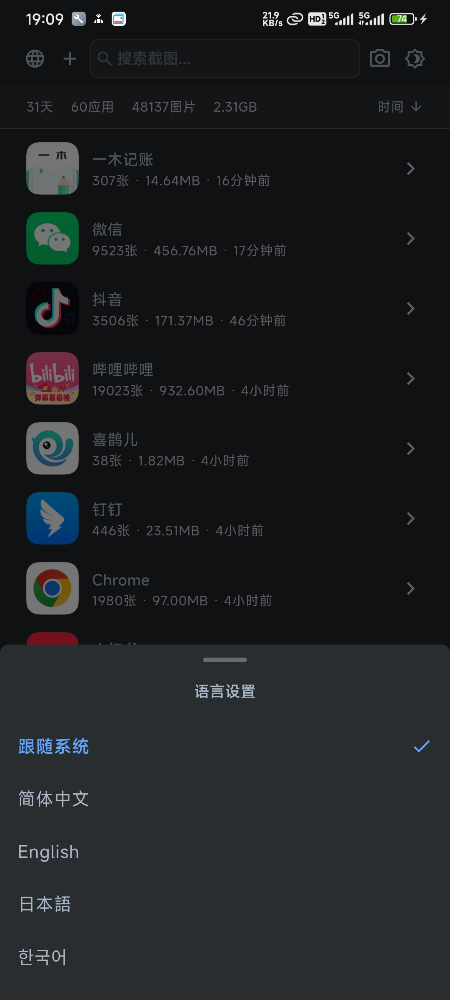
      <div align="center"><sub>首页</sub></div>
    </td>
    <td align="center" valign="top">
      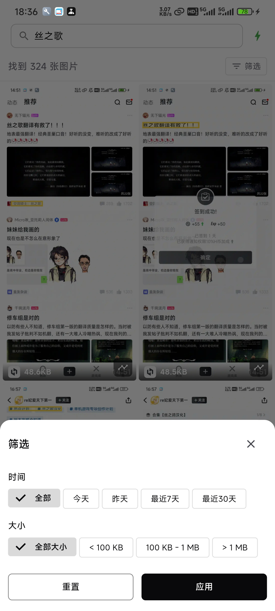
      <div align="center"><sub>搜索</sub></div>
    </td>
    <td align="center" valign="top">
      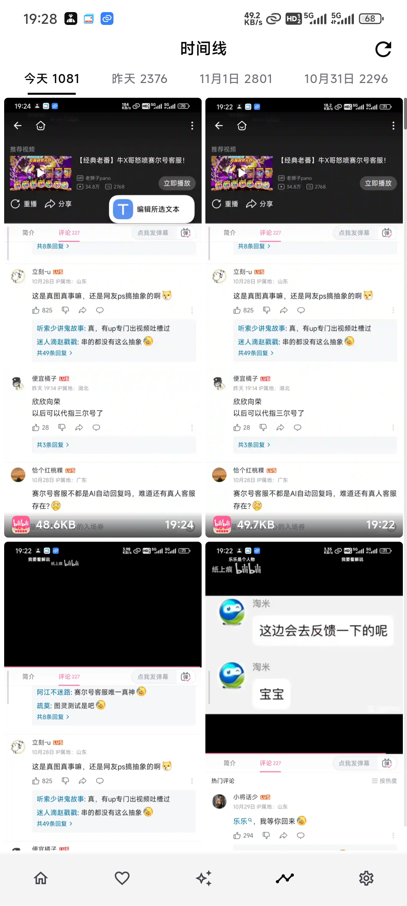
      <div align="center"><sub>时间线</sub></div>
    </td>
  </tr>
  <tr>
    <td align="center" valign="top">
      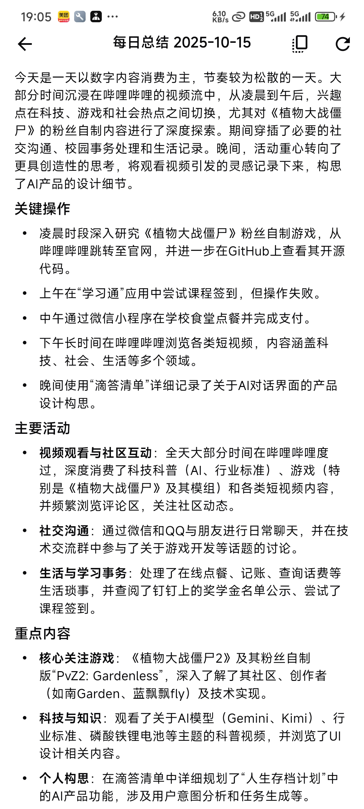
      <div align="center"><sub>每日总结</sub></div>
    </td>
    <td align="center" valign="top">
      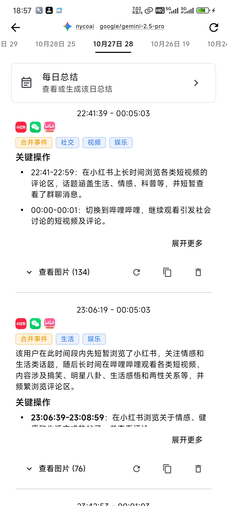
      <div align="center"><sub>事件</sub></div>
    </td>
    <td align="center" valign="top">
      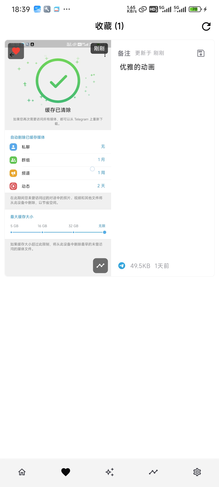
      <div align="center"><sub>收藏</sub></div>
    </td>
  </tr>
  <tr>
    <td align="center" valign="top">
      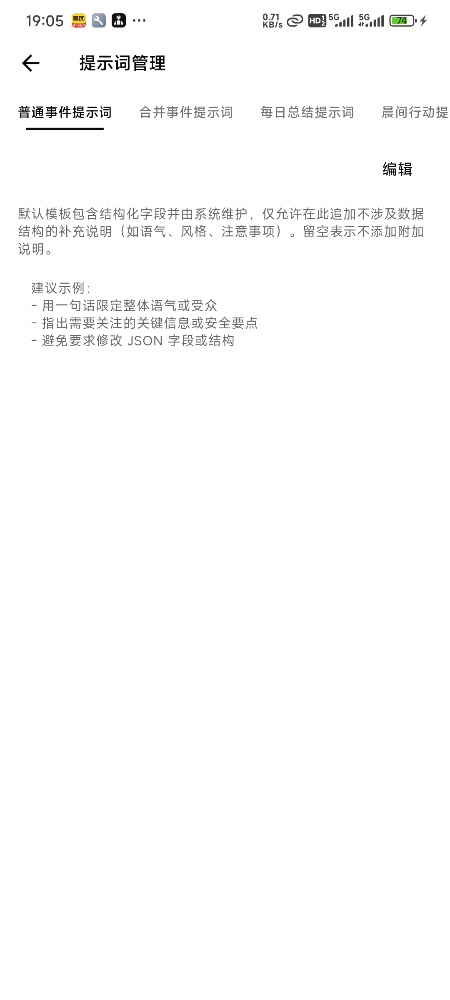
      <div align="center"><sub>提示词管理</sub></div>
    </td>
    <td align="center" valign="top">
      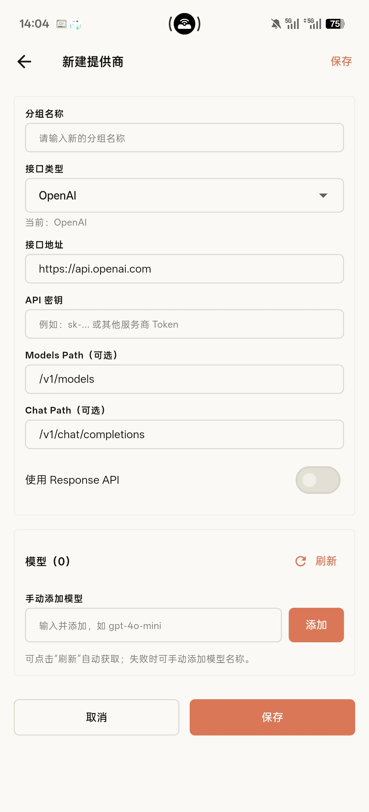
      <div align="center"><sub>新增 AI</sub></div>
    </td>
    <td align="center" valign="top">
      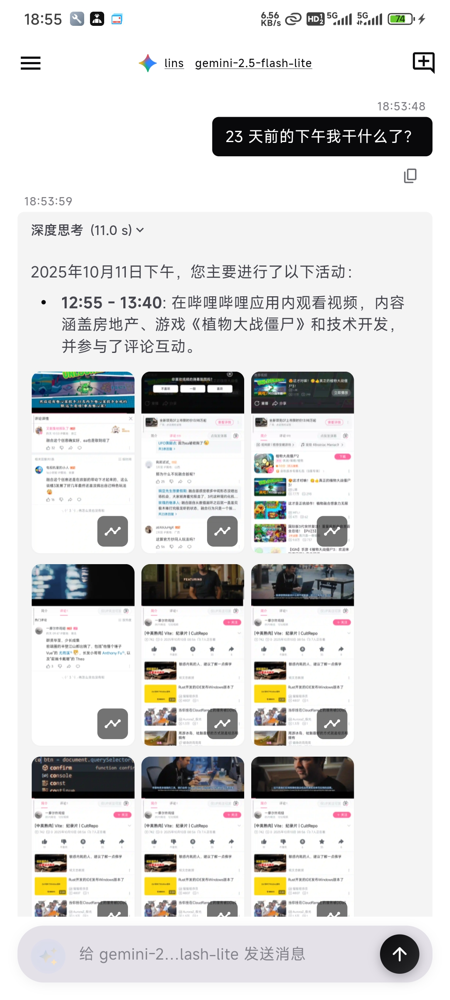
      <div align="center"><sub>AI 对话</sub></div>
    </td>
  </tr>
  <tr>
    <td align="center" valign="top">
      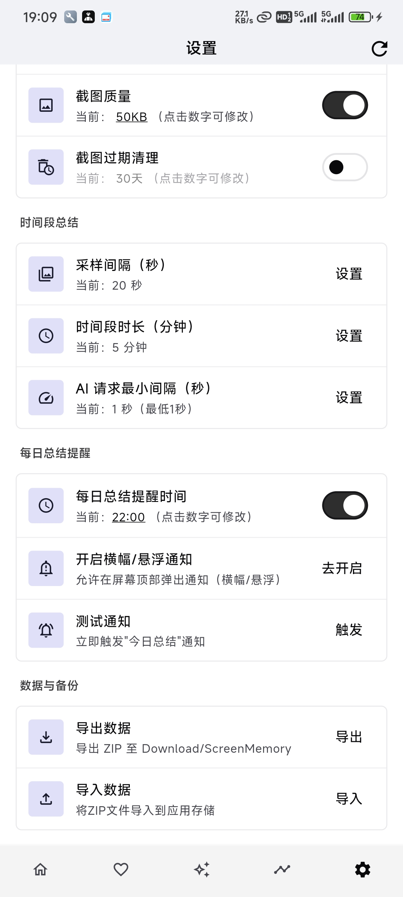
      <div align="center"><sub>设置</sub></div>
    </td>
    <td align="center" valign="top">
      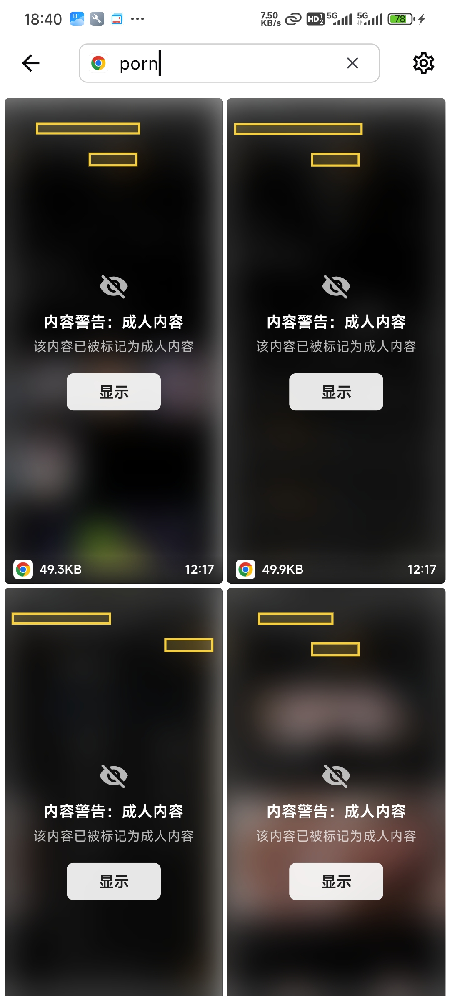
      <div align="center"><sub>NSFW过滤</sub></div>
    </td>
    <td align="center" valign="top">
      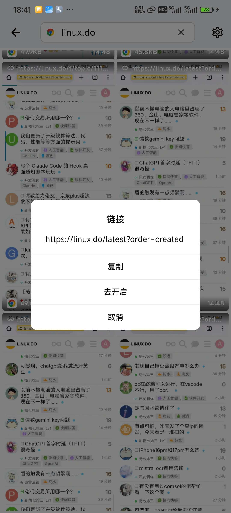
      <div align="center"><sub>深度链接</sub></div>
    </td>
  </tr>
</table>


### 特色功能

- 深度链接：支持自动记录浏览器链接
- NSFW 遮罩：对常见成人域名进行自动遮罩，可自定义域名
- 应用自定义设置：应用可以单独配置采集策略（是否采集、采集频率、分辨率/压缩等），针对 游戏/视频/阅读类 提供优化预设。
- 界面主题：默认主色升级为 ScreenMemo 蓝（#3B82F6），并可在设置里改回石墨黑或其他种子色。
- 周总结：从首次使用日起每 7 天自动生成周总结，按日期拆解每日动态，方便回顾阶段性重点。
- 画像文章：在记忆中心手动触发画像文章生成，采用与每日总结一致的阅读体验并支持流式输出。

---

## 常见问题（FAQ）

<details>
<summary>每月大概占用多少存储空间？</summary>

- 经验值示例：若开启图片压缩至约 50 KB/张，且按每分钟 1 张截图，30 天 ≈ 43,200 张，约 2.1 GB/月。
- 估算公式：月占用（GB）≈ (60 ÷ 截屏间隔秒) × 60 × 24 × 30 × 单张大小（KB） ÷ 1024 ÷ 1024。
- 降占用建议：增大截屏间隔（如 ≥60 秒/张）、启用图片压缩、打开过期清理（仅保留近 30/60 天）、排除不必要的应用与场景。
</details>

<details>
<summary>数据会上传到云端吗？</summary>

- 默认所有数据（截图、OCR 文本、索引、统计）均保存在本地，不会上传至云端。你可随时暂停采集、清空数据与导出备份。
</details>

<details>
<summary>如何排除敏感应用？</summary>

- 可在设置中对特定应用关闭采集，避免记录敏感内容。
</details>

<details>
<summary>对电量与性能的影响如何？</summary>

- 主要与截屏间隔、图片尺寸/压缩和前台识别频率相关。建议开启压缩与过期清理以降低资源占用。
</details>

<details>
<summary>如何备份/迁移数据？</summary>

- 在“数据导入导出”中可一键导出/导入素材与数据库，用于迁移或归档。
- 导入时可选择“覆盖导入”或“合并导入”：合并模式会保留当前数据并将压缩包内容去重后并入现有库，适合把多份备份拼接到一起。
</details>

## 快速开始

### 环境要求
- **Flutter SDK**: 3.8.1 或更高版本
- **Dart SDK**: 3.8.1+
- **Android Studio** / **VS Code** + Flutter 插件
- **Android SDK**:
  - 最低版本（minSdkVersion）: 21
  - 目标版本（targetSdkVersion）: 34
- 平台要求：自动截屏功能依赖 Android 11（API 30）及以上（使用无障碍 `takeScreenshot`）
- **JDK**: 11 或更高版本

### 安装步骤

1. **克隆项目**
   ```bash
   git clone <repository-url>
   cd screen_memo
   ```

2. **安装依赖**
   ```bash
   flutter pub get
   ```

3. **生成国际化文件**
   ```bash
   flutter gen-l10n
   ```

4. **运行应用**（开发模式）
   ```bash
   # 连接 Android 设备或启动模拟器
   flutter run
   ```

### 在电脑上通过 Android 虚拟机运行并测试

如果你希望在电脑上，使用 Android 虚拟手机（AVD 模拟器）来运行和测试 ScreenMemo，可以参考以下步骤：

1. **准备虚拟设备**
   - 在 Android Studio 中打开 **Device Manager**，创建一个 Android 虚拟设备（建议 Android 11+）。
   - 创建完成后，点击启动该虚拟设备，确保模拟器处于运行状态。

2. **用命令行启动并选择模拟器**

   ```bash
   # 列出可用的模拟器
   flutter emulators

   # 启动指定模拟器（将 <emulator_id> 替换为上一步看到的 ID）
   flutter emulators --launch <emulator_id>

   # 查看当前已连接的设备（包括虚拟机）
   flutter devices

   # 在指定的虚拟机上运行应用
   flutter run -d <device_id>
   ```

   其中 `<device_id>` 可以是上面 `flutter devices` 中列出的模拟器 ID，例如 `emulator-5554`。

### 开发命令

```bash
# 构建 Debug APK
flutter build apk --debug

# 安装到设备
flutter install

# 查看日志
adb logcat | findstr "ScreenMemo"  # Windows
adb logcat | grep "ScreenMemo"     # Linux/macOS

# 代码检查
flutter analyze
```

---

## 构建

生成按 ABI 拆分的优化 APK（体积最小化）：

```powershell
flutter clean
flutter pub get
flutter build apk --release --split-per-abi --tree-shake-icons --obfuscate --split-debug-info=build/symbols
```

**产物位置**：
- `build/app/outputs/flutter-apk/app-arm64-v8a-release.apk`
- `build/app/outputs/flutter-apk/app-armeabi-v7a-release.apk`
- `build/app/outputs/flutter-apk/app-x86_64-release.apk`
---

## 权限说明

应用需要以下权限以提供完整功能：

| 权限     | 用途                  | 必需性 |
|--------|---------------------|-----|
| 存储权限   | 保存截屏和数据文件           | 必需  |
| 通知权限   | 展示服务状态与提醒通知         | 必需  |
| 无障碍服务  | 自动截屏与前台应用识别         | 必需  |
| 使用统计权限 | 获取前台应用（Usage Stats） | 必需  |

> 所有权限均在首次运行时引导用户授予，并可随时在系统设置中撤销。

---

## 国际化

当前支持语言：
- 简体中文（默认）
- English
- 日本語
- 한국어

添加新语言

1. 在 `lib/l10n/` 目录创建新的 `.arb` 文件（如 `app_ja.arb`）
2. 复制 `app_en.arb` 的内容并翻译
3. 运行 `flutter gen-l10n` 生成代码
4. 在 `LocaleService` 中注册新语言

---

## 贡献指南

欢迎贡献代码、报告问题或提出建议！

1. Fork 本项目
2. 创建特性分支（`git checkout -b feature/AmazingFeature`）
3. 提交更改（`git commit -m 'feat: add some amazing feature'`）
4. 推送到分支（`git push origin feature/AmazingFeature`）
5. 提交 Pull Request

请确保：
- 代码通过 `flutter analyze` 检查
- 添加必要的测试用例
- 更新相关文档

---

## 致谢

感谢以下开源项目：
- [Flutter](https://flutter.dev) - UI 框架
- [Google ML Kit](https://developers.google.com/ml-kit) - 文本识别
- [SQLite](https://www.sqlite.org/) - 数据库引擎
- 所有贡献者和依赖包的维护者

