<div align="center">


# ScreenMemo

本地优先的自动截屏记忆工具：自动截屏、OCR 全文检索，以及可选的 AI 总结/回放。

「屏幕无痕，记忆有痕」

[](https://dart.dev) [](https://www.android.com) [](LICENSE)


</div>

<p align="center">
  <b>语言</b>:
  简体中文 |
  <a href="README.en.md">English</a> |
  <a href="README.ja.md">日本語</a> |
  <a href="README.ko.md">한국어</a>
</p>

---

## 项目简介

ScreenMemo 是一款本地优先的截屏备忘与检索工具：在你授权后自动记录 Android 设备的屏幕画面，并通过 OCR 构建全文检索；也可以按需开启 AI 总结，把一段时间内的信息压缩成可回顾的摘要，方便你在需要时迅速找回线索、还原上下文。

---
## 从今天开始构建你的个人数字记忆

**为什么现在就要开始？**
- **不可逆的知识流失**：当越来越多人开始用日常数据喂养个人 AI，每一天的未曾记录，都在让你未来的 AI 助手少了一分“懂你”的底气。
- **悄然拉开的时间复利**：数据无法速成。今天就开始沉淀数字标本的人，在未来 AI 迎来质变时，将天然拥有一座别人难以追赶的专属记忆库。
- **打捞散落的数字自我**：你最宝贵的上下文往往碎落在不同的 App 与设备里——如果没有 ScreenMemo 去妥善收留，它们终将随流逝的时间消散，再难被完整唤醒。

---

## 应用截图

<table>
  <tr>
    <td align="center" valign="top">
      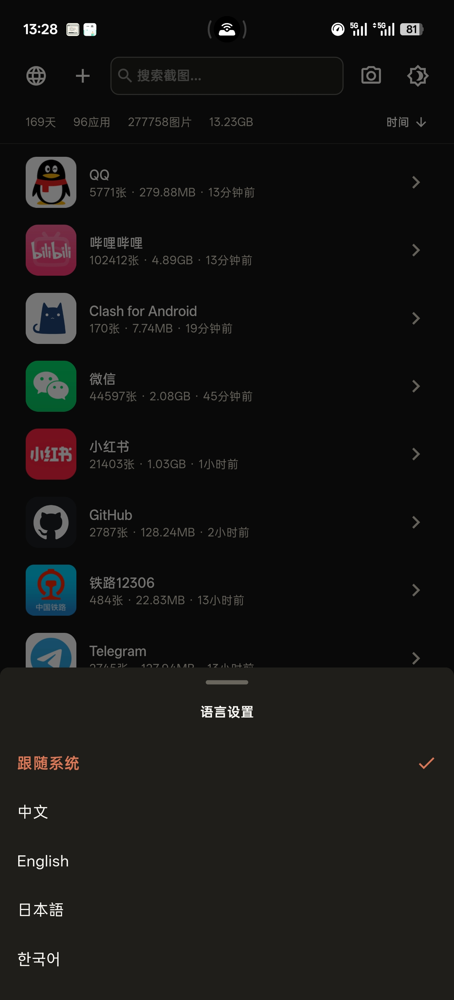
      <div align="center"><sub>首页概览</sub></div>
    </td>
    <td align="center" valign="top">
      
      <div align="center"><sub>语义搜索</sub></div>
    </td>
    <td align="center" valign="top">
      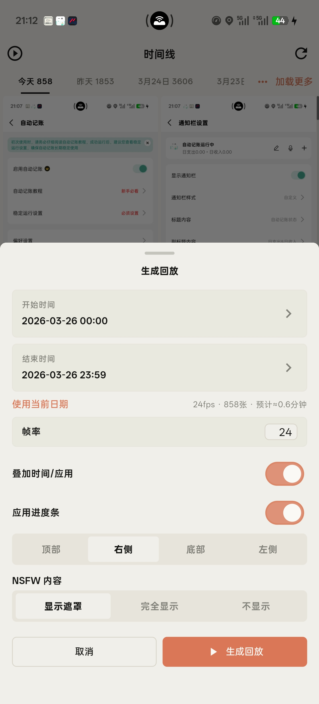
      <div align="center"><sub>时间线与生成回放</sub></div>
    </td>
  </tr>
  <tr>
    <td align="center" valign="top">
      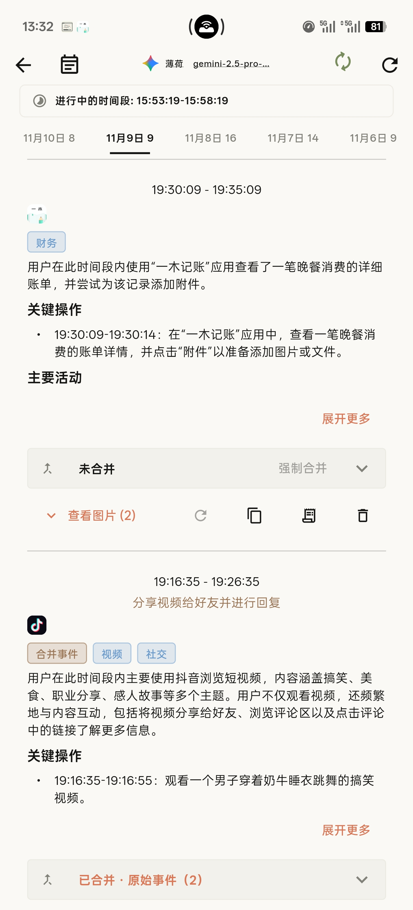
      <div align="center"><sub>事件详情</sub></div>
    </td>
    <td align="center" valign="top">
      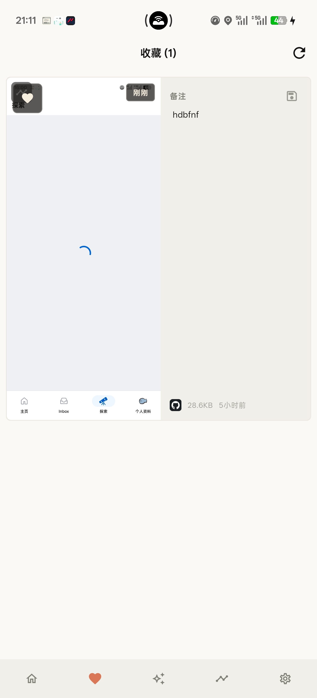
      <div align="center"><sub>收藏与备注</sub></div>
    </td>
    <td align="center" valign="top">
      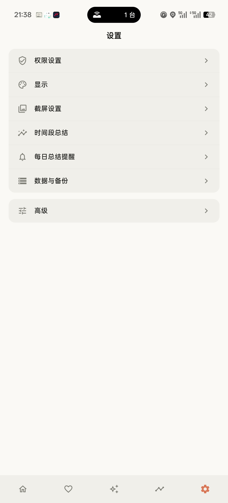
      <div align="center"><sub>设置概览</sub></div>
    </td>
  </tr>
  <tr>
    <td align="center" valign="top">
      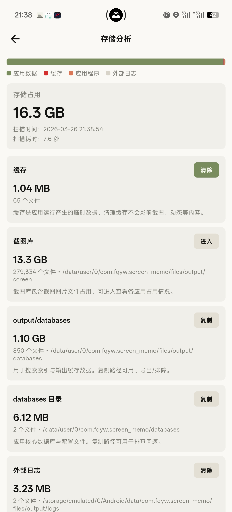
      <div align="center"><sub>存储分析</sub></div>
    </td>
    <td align="center" valign="top">
      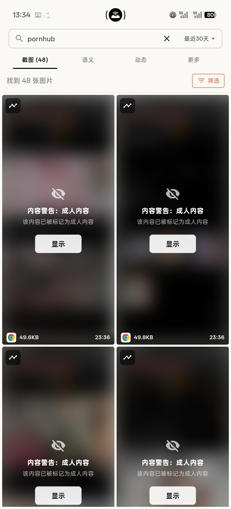
      <div align="center"><sub>NSFW 搜索结果</sub></div>
    </td>
    <td align="center" valign="top">
      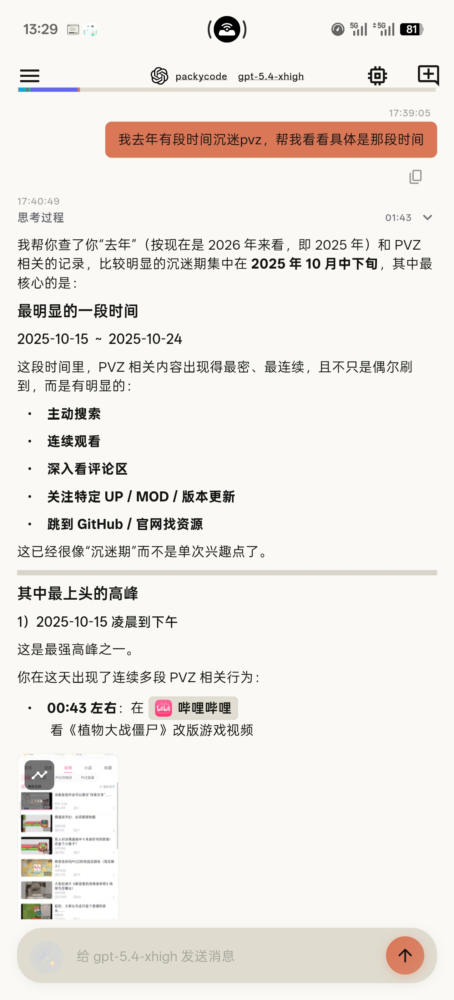
      <div align="center"><sub>AI 回顾对话</sub></div>
    </td>
  </tr>
  <tr>
    <td align="center" valign="top">
      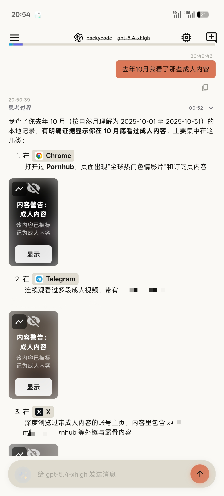
      <div align="center"><sub>敏感内容分析</sub></div>
    </td>
    <td align="center" valign="top">
      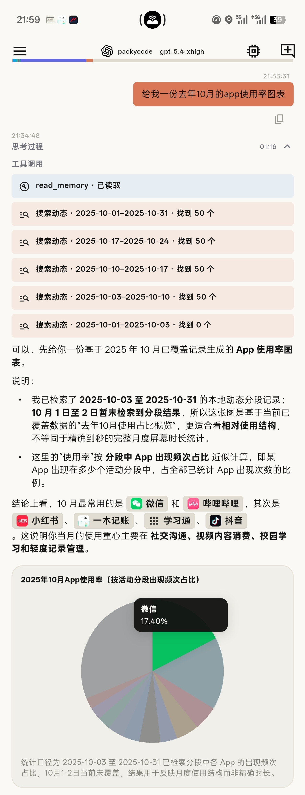
      <div align="center"><sub>AI 工具调用报告</sub></div>
    </td>
    <td align="center" valign="top">
      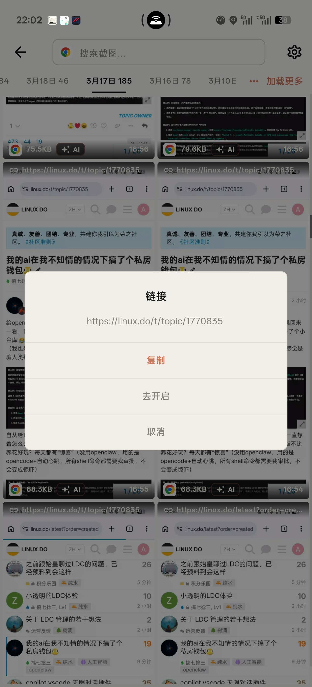
      <div align="center"><sub>深度链接</sub></div>
    </td>
  </tr>
</table>


## 常见问题（FAQ）

<details>
<summary>每月大概占用多少存储空间？</summary>

- 经验值示例：若开启图片压缩至约 50 KB/张，且按每分钟 1 张截图，30 天 ≈ 43,200 张，约 2.1 GB/月。
- 估算公式：月占用（GB）≈ (60 ÷ 截屏间隔秒) × 60 × 24 × 30 × 单张大小（KB） ÷ 1024 ÷ 1024。
- 降占用建议：增大截屏间隔（如 ≥60 秒/张）、启用图片压缩、打开过期清理（仅保留近 30/60 天）、排除不必要的应用与场景。
</details>

<details>
<summary>数据会上传到云端吗？</summary>

- 默认所有数据（截图、OCR 文本、索引、统计）均保存在本地，不会上传至云端。你可随时暂停采集、清空数据与导出备份。
</details>

<details>
<summary>如何排除敏感应用？</summary>

- 可在设置中对特定应用关闭采集，避免记录敏感内容。
</details>

<details>
<summary>对电量与性能的影响如何？</summary>

- 主要与截屏间隔、图片尺寸/压缩和前台识别频率相关。建议开启压缩与过期清理以降低资源占用。
</details>

<details>
<summary>如何备份/迁移数据？</summary>

- 在“数据导入导出”中可一键导出/导入素材与数据库，用于迁移或归档。
- 导入时可选择“覆盖导入”或“合并导入”：合并模式会保留当前数据并将压缩包内容去重后并入现有库，适合把多份备份拼接到一起。
</details>

## 快速开始

### 环境要求
- **Flutter SDK**: 3.8.1 或更高版本
- **Dart SDK**: 3.8.1+
- **Android Studio** / **VS Code** + Flutter 插件
- **Android SDK**:
  - 最低版本（minSdkVersion）: 21
  - 目标版本（targetSdkVersion）: 34
- 平台要求：自动截屏功能依赖 Android 11（API 30）及以上（使用无障碍 `takeScreenshot`）
- **JDK**: 11 或更高版本

### 安装步骤

1. **克隆项目**
   ```bash
   git clone <repository-url>
   cd screen_memo
   ```

2. **安装依赖**
   ```bash
   flutter pub get
   ```

3. **生成国际化文件**
   ```bash
   flutter gen-l10n
   ```

4. **运行应用**（开发模式）
   ```bash
   # 连接 Android 设备或启动模拟器
   flutter run
   ```

### 在电脑上通过 Android 虚拟机运行并测试

如果你希望在电脑上，使用 Android 虚拟手机（AVD 模拟器）来运行和测试 ScreenMemo，可以参考以下步骤：

1. **准备虚拟设备**
   - 在 Android Studio 中打开 **Device Manager**，创建一个 Android 虚拟设备（建议 Android 11+）。
   - 创建完成后，点击启动该虚拟设备，确保模拟器处于运行状态。

2. **用命令行启动并选择模拟器**

   ```bash
   # 列出可用的模拟器
   flutter emulators

   # 启动指定模拟器（将 <emulator_id> 替换为上一步看到的 ID）
   flutter emulators --launch <emulator_id>

   # 查看当前已连接的设备（包括虚拟机）
   flutter devices

   # 在指定的虚拟机上运行应用
   flutter run -d <device_id>
   ```

   其中 `<device_id>` 可以是上面 `flutter devices` 中列出的模拟器 ID，例如 `emulator-5554`。

### 开发命令

```bash
# 构建 Debug APK
flutter build apk --debug

# 安装到设备
flutter install

# 查看日志
adb logcat | findstr "ScreenMemo"  # Windows
adb logcat | grep "ScreenMemo"     # Linux/macOS

# 代码检查
flutter analyze
```

---

## 构建

生成按 ABI 拆分的优化 APK（体积最小化）：

```powershell
flutter clean
flutter pub get
flutter build apk --release --split-per-abi --tree-shake-icons --obfuscate --split-debug-info=build/symbols
```

**产物位置**：
- `build/app/outputs/flutter-apk/app-arm64-v8a-release.apk`
- `build/app/outputs/flutter-apk/app-armeabi-v7a-release.apk`
- `build/app/outputs/flutter-apk/app-x86_64-release.apk`

---

## 自动发布（GitHub Actions）

本项目已配置 tag 推送触发自动打包并发布到 GitHub Releases：仅当你推送 tag（如 `v1.0.0`）时才会构建，普通 push/commit 不会触发。

### 发布步骤

```bash
git tag v1.0.0
git push origin v1.0.0
```

推送后，GitHub Actions 会自动构建 **按 ABI 拆分的 Release APK**，并创建同名 Release，附带产物（APK、`symbols-*.zip`、可选 `mapping-*.txt`）。

版本规则：tag（去掉前缀 `v`）会作为 `--build-name`，`github.run_number` 作为 `--build-number`。

### 可选：配置正式签名（推荐）

如果你希望 Release APK 使用正式 keystore 签名（而不是 debug key），在仓库 `Settings -> Secrets and variables -> Actions` 中添加以下 Secrets：

- `ANDROID_KEYSTORE_BASE64`：`jks`/`keystore` 文件的 Base64
- `ANDROID_KEYSTORE_PASSWORD`：keystore 密码
- `ANDROID_KEY_ALIAS`：key alias
- `ANDROID_KEY_PASSWORD`：key 密码

> 工作流默认使用 GitHub 内置的 `GITHUB_TOKEN` 发布 Release；不需要额外提供个人 Token。

---

## 桌面数据合并工具

由于手机端合并导入性能有限，提供 Windows/macOS/Linux 桌面版数据合并工具，可在电脑上高效合并多个备份 ZIP 文件。

### 功能特性

- 选择多个导出的 ZIP 备份文件
- 指定输出目录（合并后的数据保存位置）
- 显示合并进度和详细结果
- 支持截图、数据库的完整合并

### 构建可执行文件

**Windows**：
```powershell
flutter build windows -t lib/main_desktop_merger.dart --release
```

**macOS**：
```bash
flutter build macos -t lib/main_desktop_merger.dart --release
```

**Linux**：
```bash
flutter build linux -t lib/main_desktop_merger.dart --release
```

### 产物位置

| 平台 | 输出目录 |
|------|----------|
| Windows | `build/windows/x64/runner/Release/` |
| macOS | `build/macos/Build/Products/Release/` |
| Linux | `build/linux/x64/release/bundle/` |

> 产物为文件夹，包含 `screen_memo.exe` 及所需 DLL，可直接复制整个文件夹到目标电脑运行。

---

## 权限说明

应用可能会引导你授予以下权限（不同功能对应不同权限）：

| 权限     | 用途                  | 必需性 |
|--------|---------------------|-----|
| 通知权限 | 展示前台服务状态与提醒通知 | 必需（后台采集） |
| 无障碍服务 | 自动截屏（Android 11+ `takeScreenshot`）与前台应用识别 | 必需（自动采集） |
| 使用统计权限 | 获取前台应用（Usage Stats），用于应用筛选/统计 | 必需 |
| 相册/媒体权限 | 将图片/回放视频保存到系统相册 | 可选 |
| 精确闹钟 | 定时触发每日/周总结提醒 | 可选 |

---

## 国际化

当前支持语言：
- 简体中文（默认）
- English
- 日本語
- 한국어

添加新语言

1. 在 `lib/l10n/` 目录创建新的 `.arb` 文件（如 `app_ja.arb`）
2. 复制 `app_en.arb` 的内容并翻译
3. 运行 `flutter gen-l10n` 生成代码
4. 在 `LocaleService` 中注册新语言

### i18n 审计（防止漏翻译/硬编码回归）

为避免新增“用户可见但未适配多语言”的文案，本项目提供审计工具与测试拦截：

- **ARB 一致性**：所有 `lib/l10n/*.arb` 必须与模板（`app_en.arb`）key 完全一致（缺失/多余都会失败）。
- **平台层本地化**：iOS/Android 的关键本地化声明与资源必须齐全（缺失直接失败）。
- **Flutter UI 硬编码文案**：采用 baseline 模式，只阻止**新增**硬编码字符串；历史遗留会记录在 baseline 中，后续可逐步消减。

运行检查：
```bash
dart run tool/i18n_audit.dart --check
```

更新 baseline（仅在确认是历史遗留/例外时使用）：
```bash
dart run tool/i18n_audit.dart --update-baseline
```

忽略规则（谨慎使用）：
- 行尾添加 `// i18n-ignore`：忽略该行
- 文件内任意位置添加 `// i18n-ignore-file`：忽略整个文件

`flutter test` 会自动运行 `test/i18n_audit_test.dart` 来拦截回归。

> 如果本机配置了 `HTTP_PROXY/HTTPS_PROXY`，在 Windows 上运行 `flutter test` 可能出现 `WebSocketException: Invalid WebSocket upgrade request`。可临时设置 `NO_PROXY=127.0.0.1,localhost` 或清空代理环境变量后再运行。

---

## 贡献指南

欢迎贡献代码、报告问题或提出建议！

1. Fork 本项目
2. 创建特性分支（`git checkout -b feature/AmazingFeature`）
3. 提交更改（`git commit -m 'feat: add some amazing feature'`）
4. 推送到分支（`git push origin feature/AmazingFeature`）
5. 提交 Pull Request

请确保：
- 代码通过 `flutter analyze` 检查
- 添加必要的测试用例
- 更新相关文档

---

## 致谢

感谢以下开源项目：
- [Flutter](https://flutter.dev) - UI 框架
- [Google ML Kit](https://developers.google.com/ml-kit) - 文本识别
- [SQLite](https://www.sqlite.org/) - 数据库引擎
- 所有贡献者和依赖包的维护者
